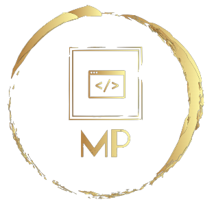

# Hello-world

  
   
  <h3><b>Hello Microverse Project</b></h3>

# 📗 Table of Contents

- [📖 About the Project](#about-project)
  - [🛠 Built With](#built-with)
    - [Tech Stack](#tech-stack)
    - [Key Features](#key-features)
  - [🚀 Live Demo](#live-demo)
- [💻 Getting Started](#getting-started)
  - [Setup](#setup)
  - [Prerequisites](#prerequisites)
  - [Install](#install)
  - [Usage](#usage)
  - [Run tests](#run-tests)
  - [Deployment](#triangular_flag_on_post-deployment)
- [👥 Authors](#authors)
- [🔭 Future Features](#future-features)
- [🤝 Contributing](#contributing)
- [⭐️ Show your support](#support)
- [🙏 Acknowledgements](#acknowledgements)
- [❓ FAQ (OPTIONAL)](#faq)
- [📝 License](#license)

# 📖  <a name="about-project">Hello_World</a>

**Hello_World** is is the first project in the Microvers full stack full time program. The goal of this project is to demonstrate the standard flow of project completion basic with git, GitHub and coding best practices. 

## 🛠 Built With 

### Tech Stack  

  
Web Technologies

  <ul>
    <li><a href="https://developer.mozilla.org/en-US/docs/Web/HTML">HTML</a></li>
    <li><a href="https://developer.mozilla.org/en-US/docs/Web/CSS">CSS</a></li>
  </ul>

### Key Features 
- **N/A**

(<a href="#readme-top">back to top</a>)

### Prerequisites
N/A

### Setup
N/A

### Install
N/A

### Usage
N/A

### Run tests
N/A

### Deployment
N/A

(<a href="#readme-top">back to top</a>)

## 👥 Author 
- GitHub: [@porag-m06](https://github.com/porag-m06)
- Twitter: [@twitterhandle](https://twitter.com/twitterhandle)
- LinkedIn: [LinkedIn](https://www.linkedin.com/in/muhammad-porag-nsu-cse/)

(<a href="#readme-top">back to top</a>)

## 🔭 Future Features 
N/A

(<a href="#readme-top">back to top</a>)

## 🤠Contributing 

Contributions, issues, and feature requests are welcome!
Feel free to check the [issues page](../../issues/).

(<a href="#readme-top">back to top</a>)

## ⭐️ Show your support 
As a tech enthusiast, your support is always appreciated. If you like this project please do let me know with your support in any way you see fit. 

(<a href="#readme-top">back to top</a>)

## 🙠Acknowledgments 
I would like to thank MICROVERSE for this wonderful project. Without this platfrom it would not been possible. 

(<a href="#readme-top">back to top</a>)

## ❓ FAQ 

- **Can I fork this project?**
  - Yes, feel free to fork and knock yourself out :) . 

- **Can I share this project with others?**
  - Yes, you can share this project for any educational purposes. 

(<a href="#readme-top">back to top</a>)

## 📠License 

This project is [MIT](./LICENSE) licensed.

(<a href="#readme-top">back to top</a>)

